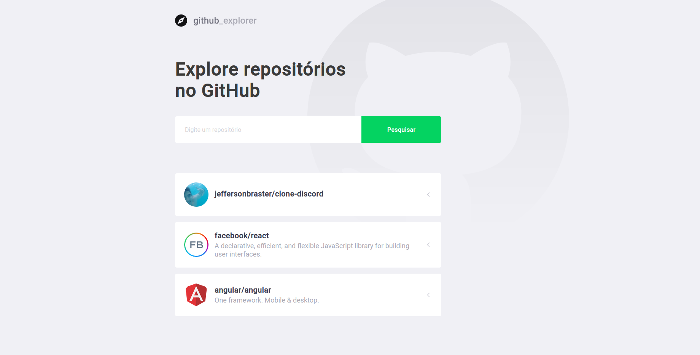

<h1 align="center">GITHUB_EXPLORE</h1>
<p align="center">Project develop in GoStack #12</p>
<p align="center">

  <a href="https://reactjs.org/">
    
  </a>

</p>
<p align="center"></p>

---

## About

Github_explore is an application to connect your favorite repositories and check your Stars, Forks, Issues

This project includes: API / Web App React

### Technologies

<ul>
    <li>React</li>
    <li>Typescript</li>
</ul>

## Run Project

Clone Project

```git
git clone https://github.com/jeffersonbraster/Git_Explore.git
```

Web

```ssh
cd primeiro-projeto-react
yarn
yarn start
```

## Author

Jefferson Brandão de Oliveira - [GitHub](https://github.com/jeffersonbraster) / [Linkedin](https://www.linkedin.com/in/jefferson-brandao-dev/) / [Email](mailto:jeffersonbraster@gmail.com)

## License

This project use MIT license, see the file [LICENSE](.github/LICENSE.md) for more details

---

<p align="center">Develop by <a href="https://github.com/jeffersonbraster">Jefferson Brandão</a></p>
